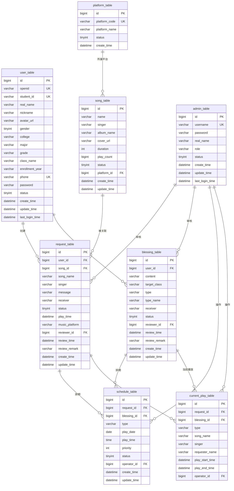

# 校园广播点歌系统 - 项目结构文档

## 一、项目概述

### 1.1 项目名称
校园广播点歌系统（Campus Radio Song Request System）

### 1.2 项目简介
校园广播点歌系统是一个基于微信小程序的校园广播点歌平台，旨在为师生提供一个便捷的点歌和送祝福渠道。学生可以通过微信小程序提交点歌请求和祝福信息，管理员通过Web后台进行审核管理，实现校园广播的数字化、智能化管理。

### 1.3 技术架构

```text
┌─────────────────┐     ┌─────────────────┐     ┌─────────────────┐
│   微信小程序     │     │   管理后台       │     │   后端服务       │
│   (miniprogram)  │     │   (admin-web)    │     │   (server)       │
└────────┬────────┘     └────────┬────────┘     └────────┬────────┘
         │                       │                       │
         └───────────────────────┼───────────────────────┘
                                 │
                         ┌───────▼───────┐
                         │   数据库       │
                         │  MySQL/SQLite  │
                         └───────────────┘
```

---

## 二、技术栈说明

### 2.1 前端技术

| 技术 | 说明 | 版本 |
|------|------|------|
| 微信小程序原生框架 | 小程序端开发框架 | 最新稳定版 |
| WXML | 小程序页面结构语言 | - |
| WXSS | 小程序样式语言 | - |
| JavaScript | 小程序逻辑处理 | ES6+ |
| HTML5 + CSS3 + JavaScript | 管理后台前端技术 | - |

### 2.2 后端技术

| 技术 | 说明 | 版本 |
|------|------|------|
| Node.js | 服务端运行环境 | >= 14.0.0 |
| Express | Web应用框架 | ^4.18.2 |
| MySQL2 | MySQL数据库驱动 | ^3.6.5 |
| SQLite3 | SQLite数据库驱动 | 内置支持 |
| JWT (jsonwebtoken) | 身份认证方案 | ^9.0.2 |
| bcryptjs | 密码加密 | ^2.4.3 |
| CORS | 跨域处理 | ^2.8.5 |
| dotenv | 环境变量管理 | ^16.3.1 |
| multer | 文件上传处理 | ^1.4.5 |
| exceljs | Excel文件处理（导入导出） | ^4.4.0 |
| pdfkit | PDF报表生成 | ^0.14.0 |
| nodemailer | 邮件发送服务 | ^6.9.0 |

### 2.3 数据库

| 技术 | 说明 | 版本 |
|------|------|------|
| MySQL | 关系型数据库（生产环境） | >= 5.7 |
| SQLite | 嵌入式数据库（开发环境） | ^3.0 |

---

## 三、目录结构详解

```plaintext
校园广播点歌系统/
│
├── miniprogram/                        # 微信小程序目录
│   ├── pages/                          # 页面目录
│   │   ├── index/                      # 首页（点歌页）
│   │   │   ├── index.js                # 页面逻辑
│   │   │   ├── index.json              # 页面配置
│   │   │   ├── index.wxml              # 页面结构
│   │   │   └── index.wxss              # 页面样式
│   │   ├── blessing/                   # 送祝福页面
│   │   │   ├── blessing.js
│   │   │   ├── blessing.json
│   │   │   ├── blessing.wxml
│   │   │   └── blessing.wxss
│   │   ├── history/                    # 历史记录页面
│   │   │   ├── history.js
│   │   │   ├── history.json
│   │   │   ├── history.wxml
│   │   │   └── history.wxss
│   │   ├── user/                       # 个人中心页面
│   │   │   ├── user.js
│   │   │   ├── user.json
│   │   │   ├── user.wxml
│   │   │   └── user.wxss
│   │   └── login/                      # 登录页面
│   │       ├── login.js
│   │       ├── login.json
│   │       ├── login.wxml
│   │       └── login.wxss
│   │
│   ├── components/                     # 自定义组件目录
│   │   └── request-modal/              # 点歌弹窗组件
│   │       ├── request-modal.js
│   │       ├── request-modal.json
│   │       ├── request-modal.wxml
│   │       └── request-modal.wxss
│   │
│   ├── utils/                          # 工具函数目录
│   │   ├── request.js                  # 网络请求封装
│   │   ├── auth.js                     # 认证相关工具
│   │   └── util.js                     # 通用工具函数
│   │
│   ├── images/                         # 图片资源目录
│   │   ├── logo.png                    # 应用Logo
│   │   ├── empty.png                   # 空状态图片
│   │   ├── tab-song.png                # 点歌Tab图标
│   │   ├── tab-song-active.png         # 点歌Tab激活图标
│   │   ├── tab-blessing.png            # 送祝福Tab图标
│   │   ├── tab-blessing-active.png     # 送祝福Tab激活图标
│   │   ├── tab-history.png             # 记录Tab图标
│   │   ├── tab-history-active.png      # 记录Tab激活图标
│   │   ├── tab-user.png                # 我的Tab图标
│   │   ├── tab-user-active.png         # 我的Tab激活图标
│   │   └── wechat-icon.png             # 微信图标
│   │
│   ├── app.js                          # 小程序入口文件
│   ├── app.json                        # 小程序全局配置
│   ├── app.wxss                        # 小程序全局样式
│   ├── project.config.json             # 项目配置文件
│   ├── project.private.config.json     # 私有配置文件
│   └── sitemap.json                    # 站点地图配置
│
├── admin-web/                          # 管理后台目录
│   ├── pages/                          # 页面目录
│   │   ├── login.html                  # 登录页面
│   │   ├── dashboard.html              # 数据概览页面
│   │   ├── songs.html                  # 歌曲管理页面
│   │   ├── audit.html                  # 审核管理页面
│   │   ├── schedule.html               # 播放排期页面
│   │   ├── play.html                   # 播放控制页面
│   │   ├── stats.html                  # 数据统计页面
│   │   ├── users.html                  # 用户管理页面
│   │   └── homepage.html               # 首页配置页面
│   │
│   ├── js/                             # JavaScript目录
│   │   ├── app.js                      # 应用主逻辑
│   │   ├── router.js                   # 路由管理
│   │   └── api.js                      # API接口封装
│   │
│   ├── css/                            # 样式目录
│   │   └── style.css                   # 全局样式
│   │
│   ├── index.html                      # 入口页面
│   └── favicon.ico                     # 网站图标
│
├── server/                             # 后端服务目录
│   ├── config/                         # 配置目录
│   │   ├── config.js                   # 主配置文件
│   │   ├── db.js                       # MySQL数据库连接
│   │   └── db-sqlite.js                # SQLite数据库连接
│   │
│   ├── controllers/                    # 控制器目录
│   │   ├── userController.js           # 用户控制器
│   │   ├── songController.js           # 歌曲控制器
│   │   ├── requestController.js        # 点歌请求控制器
│   │   ├── blessingController.js       # 祝福控制器
│   │   ├── adminController.js          # 管理员控制器
│   │   ├── scheduleController.js       # 播放排期控制器
│   │   ├── playController.js           # 播放控制控制器
│   │   ├── statsController.js          # 数据统计控制器
│   │   ├── homepageController.js       # 首页控制器
│   │   ├── uploadController.js         # 文件上传控制器
│   │   ├── batchController.js          # 批量操作控制器
│   │   └── sensitiveController.js      # 敏感词控制器
│   │
│   ├── routes/                         # 路由目录
│   │   ├── user.js                     # 用户路由 (/api/users)
│   │   ├── song.js                     # 歌曲路由 (/api/songs)
│   │   ├── request.js                  # 点歌请求路由 (/api/requests)
│   │   ├── blessing.js                 # 祝福路由 (/api/blessings)
│   │   ├── admin.js                    # 管理员路由 (/api/admin)
│   │   ├── schedule.js                 # 播放排期路由 (/api/admin/schedule)
│   │   ├── play.js                     # 播放控制路由 (/api/play)
│   │   ├── stats.js                    # 数据统计路由 (/api/admin/stats)
│   │   ├── homepage.js                 # 首页路由 (/api/homepage)
│   │   ├── upload.js                   # 文件上传路由 (/api/upload)
│   │   ├── batch.js                    # 批量操作路由 (/api/batch)
│   │   └── sensitive.js                # 敏感词路由 (/api/sensitive)
│   │
│   ├── middleware/                     # 中间件目录
│   │   ├── auth.js                     # 认证中间件（JWT验证）
│   │   ├── errorHandler.js             # 错误处理中间件
│   │   └── sensitiveFilter.js          # 敏感词过滤中间件
│   │
│   ├── utils/                          # 工具函数目录
│   │   ├── logger.js                   # 日志工具
│   │   ├── response.js                 # 响应格式化工具
│   │   └── sensitiveWords.js           # 敏感词配置
│   │
│   ├── scripts/                        # 脚本目录
│   │   ├── start.js                    # 启动脚本
│   │   ├── createAdmin.js              # 创建管理员脚本
│   │   ├── testApi.js                  # API测试脚本
│   │   ├── checkData.js                # 数据检查脚本
│   │   ├── fixEncoding.js              # 编码修复脚本
│   │   ├── migrate-db.js               # 数据库迁移脚本
│   │   ├── migrateToSqlite.js          # MySQL迁移到SQLite脚本
│   │   └── clean-duplicates.js         # 清理重复数据脚本
│   │
│   ├── data/                           # SQLite数据目录
│   │   ├── campus_radio.db             # SQLite数据库文件
│   │   ├── campus_radio.db-shm         # SQLite共享内存文件
│   │   └── campus_radio.db-wal         # SQLite预写日志文件
│   │
│   ├── images/                         # 静态图片目录
│   │   ├── songs/                      # 歌曲封面图片
│   │   │   ├── 七里香.jpg
│   │   │   └── 稻香.jpg
│   │   ├── logo.png
│   │   ├── empty.png
│   │   └── ...                         # 其他图标资源
│   │
│   ├── backups/                        # 数据备份目录
│   │   ├── admin_table_backup_*.json   # 管理员表备份
│   │   ├── request_table_backup_*.json # 点歌请求表备份
│   │   ├── song_table_backup_*.json    # 歌曲表备份
│   │   └── user_table_backup_*.json    # 用户表备份
│   │
│   ├── logs/                           # 日志目录
│   │   ├── startup.log                 # 启动日志
│   │   └── system-startup.log          # 系统启动日志
│   │
│   ├── sql/                            # SQL脚本目录
│   │   └── homepage_tables.sql         # 首页相关表结构
│   │
│   ├── server.js                       # 服务入口文件
│   ├── package.json                    # 项目依赖配置
│   ├── .env                            # 环境变量配置
│   └── .env.example                    # 环境变量示例
│
├── database/                           # 数据库脚本目录
│   ├── schema.sql                      # 数据库表结构（MySQL）
│   ├── init.sql                        # 初始化数据
│   ├── migrations/                     # 数据库迁移脚本
│   │   └── add_current_play_table.sql  # 添加当前播放表
│   ├── migrate_add_fields.sql          # 添加字段迁移
│   ├── migrate_song_request_fields.sql # 歌曲请求字段迁移
│   ├── migrate_user_fields.sql         # 用户字段迁移
│   └── fix_encoding.sql                # 编码修复脚本
│
├── docs/                               # 文档目录
│   ├── api.md                          # API接口文档
│   └── project-structure.md            # 项目结构文档
│
├── .trae/                              # Trae配置目录
│   ├── rules/                          # 规则配置
│   │   └── project_rules.md            # 项目开发规范
│   ├── skills/                         # 技能配置
│   │   └── wechat-miniprogram/         # 微信小程序技能
│   ├── specs/                          # 规格说明
│   │   └── build-campus-radio-system/
│   └── documents/                      # 文档目录
│       └── 小程序问题诊断与修复计划.md
│
├── README.md                           # 项目说明文档
├── package.json                        # 根项目依赖配置
└── start.js                            # 统一启动脚本
```

---

## 四、核心模块功能描述

### 4.1 小程序端模块 (miniprogram)

#### 4.1.1 页面模块

| 页面 | 路径 | 功能描述 |
|------|------|----------|
| 首页 | pages/index | 展示个性化推荐歌单（基于用户年级/学院偏好）、热门歌曲榜单、智能搜索（支持模糊匹配与热词联想）、快捷点歌表单（含歌曲+祝福语）、系统公告跑马灯、校园活动轮播图、当前播放器（含进度条与切歌功能） |
| 送祝福 | pages/blessing | 支持文本/语音祝福提交（可选匿名）、智能配乐推荐、指定接收人（学号/昵称）或公开祝福、祝福列表展示（含点赞/举报功能）、精选祝福置顶、祝福历史回顾（按节日/学期分类） |
| 历史记录 | pages/history | 分标签查看点歌记录（成功/失败/待播放）、祝福发送记录、播放记录（含收听时长统计）、支持按时间范围筛选、记录导出（Excel格式）、删除单条记录功能 |
| 个人中心 | pages/user | 用户信息编辑（头像/昵称/真实姓名/性别/学院/专业/年级/班级/入学年份）、学号绑定与修改、隐私设置（祝福可见范围）、数据看板（个人点歌排行、祝福获赞TOP3）、消息通知中心（审核结果/系统公告）、退出登录与切换账号 |
| 登录 | pages/login | 微信一键登录（获取基础信息）、学号+密码登录、登录状态持久化（30天免密）、新用户引导（完善学号/姓名/学院/专业/年级/班级/入学年份信息）、登录失败提示（学号不存在/密码错误） |

#### 4.1.2 组件模块

| 组件 | 路径 | 功能描述 |
|------|------|----------|
| 点歌弹窗 | components/request-modal | 点歌提交弹窗组件。包含歌曲搜索与自动补全（调用搜索接口）、已点歌曲查重提示、祝福语输入框（支持Emoji表情、字数实时统计与限制，如100字）、接收人/班级选择器（支持模糊搜索学号或昵称）、匿名点歌开关（受后台权限控制）、表单验证（必填项高亮提示、敏感词实时拦截并提示）、提交后状态反馈（成功提示、失败原因Toast） |

#### 4.1.3 工具模块

| 文件 | 功能描述 |
|------|----------|
| request.js | 网络请求封装工具。统一配置 baseURL 和 timeout；请求拦截器中自动注入 Token（从 auth 模块获取）；响应拦截器中统一处理 HTTP 状态码（401跳转登录、403/500错误提示）；封装 GET/POST/PUT/DELETE 方法，支持 params 和 data 区分传参；提供文件上传专用方法（含进度回调）；对业务错误码（如点歌次数超限、歌曲已禁播、敏感词拦截）进行特殊拦截与提示 |
| auth.js | 认证与权限管理工具。提供登录（微信授权、学号密码）、登出接口封装；Token 的加密存储（localStorage）与读取；登录状态检查（isLogin）与 Token 有效性验证（检查过期时间）；用户信息（userInfo）的缓存与更新；权限指令（如 checkRole）用于路由守卫和按钮级权限控制；处理 Token 过期自动刷新逻辑（若有 refreshToken 机制）等 |
| util.js | 通用工具函数库。包含时间格式化（formatTime，支持 'YYYY-MM-DD' 等多种格式）、金额格式化、防抖（debounce）与节流（throttle）函数、全局 Toast/Loading 提示封装、对象深拷贝（deepClone）、URL 参数序列化与反序列化（parse/query）、设备类型判断（isWechat/iOS/Android）、字符串处理（去除空格、截取）、本地存储简易封装（set/get/remove）等 |

#### 4.1.4 中间件模块

| 文件 | 功能描述 |
|------|----------|
| auth.js | 认证中间件。验证 JWT Token 的有效性；解析 Token 获取用户信息并挂载到 req.user；区分用户端和管理端 Token；处理 Token 过期、无效等异常情况；为需要认证的接口提供权限保护 |
| errorHandler.js | 错误处理中间件。统一捕获和处理应用中的异常；格式化错误响应信息；区分业务错误和系统错误；记录错误日志；提供友好的错误提示信息 |
| sensitiveFilter.js | 敏感词过滤中间件。检测请求内容中的敏感词；根据敏感词级别进行拦截或标记；支持自动替换敏感词；记录敏感词触发日志；可配置过滤规则和敏感词库 |

### 4.2 管理后台模块 (admin-web)

#### 4.2.1 页面模块

| 页面 | 文件 | 功能描述 |
|------|------|----------|
| 登录 | login.html | 管理员账号密码登录、记住我功能、登录失败锁定机制、验证码校验、多端登录提醒 |
| 仪表盘 | dashboard.html | 核心数据可视化（日活/点歌量/祝福量）、待审核内容快速入口（点歌/祝福）、今日播放排期日历（含紧急插播按钮）、系统健康状态监测、近期公告预览 |
| 歌曲管理 | songs.html | 歌曲全生命周期管理（增删改查）、批量导入/导出（支持Excel/CSV）、多条件筛选（歌名/歌手/专辑/时长/状态）、敏感词自动检测与标记、歌曲播放试听、数据统计（播放量/点播量排行） |
| 审核管理 | audit.html | 点歌与祝福内容审核（通过/驳回）、批量审核操作、敏感内容高亮提示、审核日志记录（操作人/时间/结果）、按状态（待审/已审/驳回）筛选、驳回原因备注与通知 |
| 播放排期 | schedule.html | 播放计划可视化管理（日/周视图）、定时播放设置、紧急插播功能（高优先级）、播放队列调整（拖拽排序）、排期冲突检测与提示、历史排期归档与查看 |
| 播放控制 | play.html | 实时播放控制（播放/暂停/切歌/音量）、当前播放队列管理（移除/调整顺序）、历史播放记录查询（含操作人）、手动添加歌曲到队列、播放日志导出（时间/歌曲/操作人） |
| 数据统计 | stats.html | 多维度数据图表分析（日/周/月/年）、点歌排行（歌曲/用户/学院）、祝福互动统计、用户活跃度分析、导出统计报表（PDF/Excel）、自定义时间范围筛选 |
| 用户管理 | users.html | 用户全生命周期管理（增删改查/禁用/启用）、学生信息管理（学号/姓名/学院/专业/年级/班级/入学年份）、角色权限分配（super_admin超级管理员/admin管理员/editor编辑）、登录日志记录、批量操作（导入/导出/状态修改）、敏感操作审计、按学院/专业/年级/入学年份/状态筛选 |
| 首页配置 | homepage.html | 轮播图管理（增删改排序/跳转链接）、公告发布与管理（置顶/定时发布/撤回）、推荐歌单配置（手动/自动推荐规则设置）、首页模块显隐控制、配置版本回滚 |

#### 4.2.2 核心JS模块

| 文件 | 功能描述 |
|------|----------|
| app.js | 应用主入口文件，负责全局初始化（配置项加载、环境检测、第三方SDK注入），注册全局组件与指令，定义全局状态（如播放状态、用户信息），实现全局异常捕获（错误边界），封装全局Toast/Message提示方法，处理应用生命周期（启动/隐藏/显示），配置全局样式与主题 |
| router.js | 前端路由配置与管理，定义路由表（路径/组件/元信息），实现路由守卫（前置守卫：权限验证/登录重定向/页面埋点；后置守卫：页面标题更新），处理路由参数传递与解析，支持懒加载（代码分割），配置404/500等异常路由处理，管理路由历史栈（前进/后退逻辑） |
| api.js | 统一API接口管理，封装所有后端接口请求（基于 request.js），按模块组织（用户模块、歌曲模块、祝福模块、统计模块），提供接口调用方法（带参数校验与默认值），处理接口响应数据格式化，支持Mock数据切换（开发/生产环境），记录接口调用日志，封装服务器健康检查接口（心跳检测） |

### 4.3 后端服务模块 (server)

#### 4.3.1 控制器模块

| 控制器 | 文件 | 功能描述 |
|--------|------|----------|
| 用户控制器 | userController.js | 处理用户登录认证（微信/学号密码）、用户注册与信息完善（学号/姓名/学院/专业/年级/班级/入学年份）、用户信息CRUD、密码重置与修改、用户状态管理（启用/禁用）、获取用户统计数据（点歌数/祝福获赞数）、学号绑定与验证 |
| 歌曲控制器 | songController.js | 歌曲信息CRUD操作、歌曲文件上传与管理、多条件搜索（歌名/歌手/专辑）、热门推荐算法接口、批量导入/导出歌曲、敏感词过滤与审核状态更新、获取播放列表 |
| 点歌请求控制器 | requestController.js | 提交点歌请求（含歌曲/祝福语/接收人）、点歌审核流程（通过/驳回）、获取个人点歌历史、获取全局点歌列表（分页/筛选）、批量审核操作、查重校验与优先级设置 |
| 祝福控制器 | blessingController.js | 提交祝福信息（文本/语音）、祝福审核管理（通过/驳回）、获取祝福列表（公开/指定接收人）、祝福互动（点赞/评论）、祝福分类展示（按节日/学期）、祝福历史归档与检索 |
| 管理员控制器 | adminController.js | 管理员账号登录与权限验证、获取仪表盘核心数据（待办/播放排期）、管理员信息管理（头像/昵称/密码修改）、操作日志记录、多角色权限分配（super_admin超级管理员/admin管理员/editor编辑） |
| 播放排期控制器 | scheduleController.js | 管理播放排期计划（增删改查）、设置定时播放任务、紧急插播功能（高优先级插入）、排期冲突检测与处理、获取当前播放队列、播放状态同步（播放中/暂停/结束） |
| 播放控制控制器 | playController.js | 控制播放器状态（播放/暂停/切歌/音量）、管理播放队列（添加/移除/排序）、获取当前播放歌曲信息、同步歌词数据、记录播放历史（用户/时间/歌曲）、手动触发播放下一首 |
| 数据统计控制器 | statsController.js | 统计点歌数据（日/周/月维度）、生成排行榜（歌曲/用户/学院）、分析用户活跃度趋势、祝福互动统计（点赞/评论分布）、导出统计报表（Excel/PDF格式）、自定义时间范围数据查询 |
| 首页控制器 | homepageController.js | 获取首页轮播图配置、管理系统公告（发布/置顶/撤回）、配置推荐歌单（手动/自动规则）、获取热门歌曲榜单、首页模块显隐控制数据、配置版本管理与回滚 |

#### 4.3.2 路由模块

| 路由 | 文件 | API前缀 | 功能描述 |
| :--- | :--- | :--- | :--- |
| 用户路由 | user.js | /api/users | 处理用户注册、登录（微信/学号密码）、信息获取与更新、学号绑定、密码重置、用户状态管理（启用/禁用）、获取用户点歌与祝福统计。支持按学院/专业/年级/入学年份筛选用户。 |
| 歌曲路由 | song.js | /api/songs | 处理歌曲信息的增删改查、批量导入/导出、搜索（歌名/歌手/专辑）、获取热门/推荐歌曲、歌曲状态管理（上架/下架）。 |
| 点歌请求路由 | request.js | /api/requests | 处理点歌提交、审核（通过/驳回）、获取个人/全局点歌历史、批量审核、查重校验、设置点歌优先级。 |
| 祝福路由 | blessing.js | /api/blessings | 处理祝福提交、审核、获取祝福列表（公开/指定）、点赞/评论、分类展示（节日/学期）、祝福归档。 |
| 管理员路由 | admin.js | /api/admin | 处理管理员登录、权限验证、信息管理、操作日志、角色权限分配、系统配置管理。 |
| 播放排期路由 | schedule.js | /api/admin/schedule | 管理播放排期（增删改查）、定时播放设置、紧急插播、排期冲突检测、获取当前播放队列、同步播放状态。 |
| 播放控制路由 | play.js | /api/play | 控制播放状态（播放/暂停/切歌/音量）、管理播放队列（增删改/排序）、获取当前播放信息、同步歌词、记录播放历史。 |
| 数据统计路由 | stats.js | /api/admin/stats | 获取点歌/祝福统计数据、生成排行榜（歌曲/用户/学院）、用户活跃度分析、导出报表（Excel/PDF）、自定义时间范围查询。 |
| 首页路由 | homepage.js | /api/homepage | 获取首页轮播图、公告、推荐歌单、热门榜单、首页模块配置、配置版本管理与回滚。 |

#### 4.3.3 中间件模块

| 中间件 | 文件 | 功能描述 |
|--------|------|----------|
| 认证中间件 | auth.js | 负责 JWT Token 的验证（提取、解析、过期校验），用户身份识别与权限分级控制（区分普通用户与管理员），自动挂载用户信息至请求对象（req.user），拦截未授权访问并返回 401 状态码，支持 Token 刷新机制。 |
| 错误处理中间件 | errorHandler.js | 全局捕获同步与异步异常，统一格式化错误响应（包含状态码、错误消息、业务错误码），内置自定义错误类（如 ValidationError、NotFoundError），记录错误日志（堆栈信息、请求上下文），并根据环境变量区分生产/开发错误提示。 |
| 敏感词过滤中间件 | sensitiveFilter.js | 针对用户提交内容（如祝福语、评论）进行实时扫描，支持配置过滤字段（body/query/params），匹配内置敏感词库进行拦截或替换（如 `***`），记录违规内容日志，支持中英文基础匹配与词库热更新。 |

#### 4.3.4 工具模块

| 文件 | 功能描述 |
|------|----------|
| logger.js | 日志记录工具，支持不同级别日志输出（如 debug/info/warn/error），带颜色区分便于控制台阅读，支持记录请求上下文信息（如 IP、URL），日志文件自动分割与归档，便于系统监控与问题排查。 |
| response.js | 统一响应格式化工具，封装标准 JSON 响应结构（包含 code/message/data），提供成功响应、失败响应、分页响应（含分页信息）的快捷方法，确保前后端数据交互格式一致。 |
| sensitiveWords.js | 敏感词列表配置文件，定义系统级敏感词库（支持中文/英文/拼音），提供敏感词匹配与过滤算法（如 DFA 算法），支持词库热加载与动态更新，用于内容审核与安全过滤。 |

#### 4.3.5 配置模块

| 文件 | 功能描述 |
|------|----------|
| config.js | 核心配置文件，管理应用运行时配置。包含服务器配置（端口、主机、环境模式）、JWT 认证配置（密钥、过期时间）、数据库连接配置（MySQL/SQLite）、日志级别设置、上传文件路径与大小限制、第三方服务 API 密钥管理 |
| db.js | MySQL 数据库连接配置，基于 mysql2/promise 创建连接池，配置连接池参数（最小/最大连接数、空闲超时），提供获取连接、执行查询、事务管理的封装方法，支持环境变量注入配置，确保生产环境安全 |
| db-sqlite.js | SQLite 数据库连接配置，用于开发与测试环境。配置数据库文件路径、自动建表（若不存在）、内存数据库模式支持，提供与 MySQL 兼容的查询接口，简化本地开发环境搭建流程，降低开发环境依赖 |

---

收到，你要的是**标准 Markdown 格式**，已经直接整理好，没有多余的前后文，可以直接粘贴到文档里使用。

---

# 五、数据库设计（丰富版）

## 5.1 数据表概览（增强版）

| 表名             | 说明           | 主要字段（补充/优化）                                                                                                                                                                                                 | 核心优化点                         |
|------------------|----------------|----------------------------------------------------------------------------------------------------------------------------------------------------------------------------------------------------------------------|------------------------------------|
| `user_table`     | 用户表         | `id` (主键)、`openid` (唯一)、`student_id` (唯一)、`real_name`、`nickname`、`avatar_url`、`gender`、`college`、`major`、`grade`、`class_name`、`enrollment_year`、`phone` (唯一)、`password`、`status`、`create_time`、`update_time`、`last_login_time` | 补充学生字段、性别、密码字段、时间字段、增加唯一约束         |
| `song_table`     | 歌曲表         | `id` (主键)、`name`、`singer`、`cover_url`、`album_name`、`duration`、`play_count`、`status`、`create_time`、`update_time`、`platform_id`                                                                              | 补充专辑/时长/平台关联、时间字段   |
| `request_table`  | 点歌请求表     | `id` (主键)、`user_id` (外键)、`song_id` (外键)、`song_name`、`singer`、`message`、`receiver`、`status`、`play_time`、`music_platform`、`create_time`、`update_time`、`reviewer_id`、`review_time`、`review_remark` | 补充审核信息、时间字段、外键关联   |
| `blessing_table` | 祝福表         | `id` (主键)、`user_id` (外键)、`content`、`target_class`、`type`、`type_name`、`receiver`、`status`、`create_time`、`update_time`、`reviewer_id`、`review_time`、`review_remark`                                       | 补充审核信息、时间字段             |
| `admin_table`    | 管理员表       | `id` (主键)、`username` (唯一)、`password`、`real_name`、`role`、`status`、`create_time`、`update_time`、`last_login_time`                                                                                            | 补充时间字段、密码加密说明         |
| `schedule_table` | 播放排期表     | `id` (主键)、`request_id` (外键)、`blessing_id` (外键)、`type` (枚举: song/blessing)、`play_date`、`play_time`、`priority`、`status`、`create_time`、`update_time`、`operator_id`                                      | 补充操作人、时间字段、枚举类型     |
| `current_play_table` | 当前播放表 | `id` (主键，固定为1，单例)、`request_id`、`blessing_id`、`type`、`song_name`、`singer`、`requester_name`、`play_start_time`、`play_end_time`、`operator_id`                                                             | 补充结束时间、祝福关联、操作人     |
| `platform_table` | 音乐平台字典表 | `id` (主键)、`platform_code` (唯一)、`platform_name`、`status`、`create_time`                                                                                                                                       | 新增：解耦硬编码，统一平台标识      |

---

## 5.2 字段详细设计（核心表）

### 5.2.1 user_table（用户表）

| 字段名           | 类型          | 约束                                             | 说明                 |
|------------------|---------------|--------------------------------------------------|----------------------|
| `id`             | `BIGINT`      | 主键、自增                                       | 用户唯一标识         |
| `openid`         | `VARCHAR(64)` | 唯一、可为空                                     | 第三方登录标识       |
| `student_id`     | `VARCHAR(20)` | 唯一、可为空                                     | 学号（唯一标识符）   |
| `real_name`      | `VARCHAR(32)` | 可为空                                           | 真实姓名             |
| `nickname`       | `VARCHAR(32)` | 非空                                             | 用户昵称             |
| `avatar_url`     | `VARCHAR(255)`| 可为空                                           | 头像 URL             |
| `gender`         | `TINYINT`     | 非空、默认 `0`                                   | 性别：0-未知，1-男，2-女 |
| `college`        | `VARCHAR(64)` | 可为空                                           | 所属学院（学院全称） |
| `major`          | `VARCHAR(64)` | 可为空                                           | 专业名称（精确到具体专业方向） |
| `grade`          | `VARCHAR(16)` | 可为空                                           | 年级信息（如：2021级） |
| `class_name`     | `VARCHAR(32)` | 可为空                                           | 班级信息（包含班级编号及名称） |
| `enrollment_year`| `VARCHAR(4)`  | 可为空                                           | 入学年份（YYYY格式） |
| `phone`          | `VARCHAR(16)` | 唯一、可为空                                     | 手机号（脱敏存储）   |
| `password`       | `VARCHAR(255)`| 可为空                                           | 密码（BCrypt加密存储，学号密码登录时使用） |
| `status`         | `TINYINT`     | 非空、默认 `0`                                   | 0-正常 1-禁用        |
| `create_time`    | `DATETIME`    | 非空、默认 `CURRENT_TIMESTAMP`                   | 创建时间             |
| `update_time`    | `DATETIME`    | 非空、默认 `CURRENT_TIMESTAMP ON UPDATE CURRENT_TIMESTAMP` | 更新时间         |
| `last_login_time`| `DATETIME`    | 可为空                                           | 最后登录时间         |

---

### 5.2.2 song_table（歌曲表）

| 字段名           | 类型          | 约束                                             | 说明                 |
|------------------|---------------|--------------------------------------------------|----------------------|
| `id`             | `BIGINT`      | 主键、自增                                       | 歌曲唯一标识         |
| `name`           | `VARCHAR(64)` | 非空                                             | 歌曲名               |
| `singer`         | `VARCHAR(64)` | 非空                                             | 歌手名               |
| `album_name`     | `VARCHAR(64)` | 可为空                                           | 专辑名               |
| `cover_url`      | `VARCHAR(255)`| 可为空                                           | 封面 URL             |
| `duration`       | `INT`         | 可为空                                           | 歌曲时长（秒）       |
| `play_count`     | `BIGINT`      | 非空、默认 `0`                                   | 播放次数             |
| `status`         | `TINYINT`     | 非空、默认 `0`                                   | 0-正常 1-禁播        |
| `platform_id`    | `BIGINT`      | 外键（`platform_table.id`）                       | 关联音乐平台字典     |
| `create_time`    | `DATETIME`    | 非空、默认 `CURRENT_TIMESTAMP`                   | 创建时间             |
| `update_time`    | `DATETIME`    | 非空、默认 `CURRENT_TIMESTAMP ON UPDATE CURRENT_TIMESTAMP` | 更新时间         |

---

### 5.2.3 request_table（点歌请求表）

| 字段名           | 类型          | 约束                                             | 说明                 |
|------------------|---------------|--------------------------------------------------|----------------------|
| `id`             | `BIGINT`      | 主键、自增                                       | 点歌请求 ID          |
| `user_id`        | `BIGINT`      | 外键（`user_table.id`）                          | 点歌用户 ID          |
| `song_id`        | `BIGINT`      | 外键（`song_table.id`）、可为空                   | 关联歌曲表（手动输入时为空） |
| `song_name`      | `VARCHAR(64)` | 非空                                             | 歌曲名（冗余存储）   |
| `singer`         | `VARCHAR(64)` | 非空                                             | 歌手名（冗余存储）   |
| `message`        | `VARCHAR(255)`| 可为空                                           | 点歌留言             |
| `receiver`       | `VARCHAR(32)` | 可为空                                           | 赠送对象             |
| `status`         | `TINYINT`     | 非空、默认 `0`                                   | 0-待审核 1-已通过 2-已驳回 3-已播放 4-已取消 |
| `play_time`      | `DATETIME`    | 可为空                                           | 期望播放时间         |
| `music_platform` | `VARCHAR(16)` | 可为空                                           | 音乐平台（兼容旧数据）|
| `reviewer_id`    | `BIGINT`      | 外键（`admin_table.id`）、可为空                  | 审核人 ID            |
| `review_time`    | `DATETIME`    | 可为空                                           | 审核时间             |
| `review_remark`  | `VARCHAR(255)`| 可为空                                           | 审核备注（驳回原因） |
| `create_time`    | `DATETIME`    | 非空、默认 `CURRENT_TIMESTAMP`                   | 创建时间             |
| `update_time`    | `DATETIME`    | 非空、默认 `CURRENT_TIMESTAMP ON UPDATE CURRENT_TIMESTAMP` | 更新时间         |

---

### 5.2.4 platform_table（音乐平台字典表）

| 字段名           | 类型          | 约束                                             | 说明                 |
|------------------|---------------|--------------------------------------------------|----------------------|
| `id`             | `BIGINT`      | 主键、自增                                       | 平台 ID              |
| `platform_code`  | `VARCHAR(16)` | 唯一、非空                                       | 平台编码（netease/qq/kugou 等） |
| `platform_name`  | `VARCHAR(32)` | 非空                                             | 平台名称             |
| `status`         | `TINYINT`     | 非空、默认 `0`                                   | 0-启用 1-禁用        |
| `create_time`    | `DATETIME`    | 非空、默认 `CURRENT_TIMESTAMP`                   | 创建时间             |

---

## 5.3 表关系图（完善版）



---

## 5.4 状态码定义（补充说明）

### 5.4.1 点歌请求/祝福状态

| 状态值 | 说明       | 业务说明                         |
|--------|------------|----------------------------------|
| `0`    | 待审核     | 提交后未处理                     |
| `1`    | 已通过     | 审核通过，可排期                 |
| `2`    | 已驳回     | 审核不通过（需填 `review_remark`） |
| `3`    | 已播放     | 已完成播放                       |
| `4`    | 已取消     | 用户主动取消                     |

---

### 5.4.2 用户/歌曲状态

| 状态值 | 说明       | 业务说明                         |
|--------|------------|----------------------------------|
| `0`    | 正常       | 可使用/可播放                    |
| `1`    | 禁用/禁播  | 管理员手动禁用，禁止点歌/播放    |

---

### 5.4.3 播放排期状态

| 状态值 | 说明       | 业务说明                         |
|--------|------------|----------------------------------|
| `0`    | 待播放     | 已排期，未到播放时间             |
| `1`    | 已播放     | 完成播放                         |
| `2`    | 已取消     | 排期后手动取消                   |

---

## 5.5 补充设计规范

1.  **主键设计**：所有表主键统一使用 `BIGINT` 自增，避免主键溢出，兼容大数据量场景。
2.  **时间字段**：所有业务表必加 `create_time`（创建时间）和 `update_time`（更新时间），便于追溯数据变更。
3.  **外键约束**：核心关联字段添加外键约束（如 `user_id` 关联 `user_table.id`），保证数据完整性；可根据性能需求改为逻辑外键（仅规范命名，不建物理外键）。
4.  **数据冗余**：点歌请求表冗余存储 `song_name`、`singer`，避免歌曲表数据删除后请求表无法展示。
5.  **密码存储**：`admin_table.password` 需存储加密后的值（如 BCrypt 哈希），禁止明文存储。
6.  **单例表**：`current_play_table` 设置 `id` 固定为 1，或通过业务逻辑保证只有一条有效数据，避免多数据冲突。
7.  **索引建议**：
    *   `user_table`：`openid`、`student_id`、`phone`（唯一索引），`college`、`major`、`grade`、`enrollment_year`、`class_name`（普通索引，用于筛选查询）
    *   `request_table`：`user_id`、`status`、`create_time`（组合索引），`reviewer_id`（普通索引）
    *   `schedule_table`：`play_date`、`status`（组合索引），`priority`（普通索引）

---

## 5.6 音乐平台标识对照表

| 标识       | 平台名称       |
|------------|----------------|
| `netease`  | 网易云音乐     |
| `qq`       | QQ 音乐        |
| `kugou`    | 酷狗音乐       |
| `kuwo`     | 酷我音乐       |
| `xiami`    | 虾米音乐       |
| `migu`     | 咪咕音乐       |
| `local`    | 本地文件       |

---

## 六、API接口概览

### 6.1 接口分类

| 模块 | 前缀 | 说明 |
|------|------|------|
| 用户模块 | /api/users | 用户登录、注册、信息管理 |
| 歌曲模块 | /api/songs | 歌曲搜索、列表、管理 |
| 点歌请求模块 | /api/requests | 点歌提交、审核、历史 |
| 祝福模块 | /api/blessings | 祝福提交、审核、列表 |
| 管理员模块 | /api/admin | 管理员登录、仪表盘 |
| 播放排期模块 | /api/admin/schedule | 排期管理 |
| 播放控制模块 | /api/play | 播放显示、控制、队列 |
| 数据统计模块 | /api/admin/stats | 数据统计 |
| 首页模块 | /api/homepage | 首页数据 |
| 系统检查 | /api/health, /api/ready | 健康检查 |

### 6.2 认证方式

- 用户端：JWT Token，通过微信登录获取
- 管理端：JWT Token，通过管理员登录获取
- 请求头：`Authorization: Bearer <token>`

### 6.3 通用响应格式

```json
{
  "code": 0,
  "msg": "success",
  "data": {}
}
```

详细API文档请参考 [API接口文档](./api.md)

---

## 七、开发规范

### 7.1 代码规范

#### JavaScript规范
- 使用ES6+语法
- 变量命名采用驼峰命名法
- 常量使用全大写下划线命名
- 函数命名采用动词+名词形式
- 关键逻辑必须添加中文注释

#### 文件命名规范
- 页面文件：小写字母，多个单词用连字符连接
- 组件文件：以组件功能命名
- 工具文件：以功能模块命名

### 7.2 接口规范

- 所有接口返回JSON格式数据
- 统一响应格式：`{ code, msg, data }`
- 使用RESTful风格设计接口
- GET请求用于查询，POST用于创建，PUT用于更新，DELETE用于删除

### 7.3 数据库规范

- 表名使用小写字母，多个单词用下划线连接
- 主键统一使用`id`
- 时间字段使用`DATETIME`类型
- 所有表必须包含`create_time`和`update_time`字段
- 状态字段使用`TINYINT`类型

---

## 八、部署说明

### 8.1 环境要求

| 软件 | 版本要求 | 说明 |
|------|----------|------|
| Node.js | >= 14.0.0 | 服务端运行环境 |
| SQLite | >= -- | 数据库服务（生产环境） |
| 微信开发者工具 | 最新稳定版 | 小程序开发调试 |

### 8.2 配置文件

| 文件 | 说明 |
|------|------|
| server/.env | 后端环境变量配置（数据库连接、JWT密钥等） |
| miniprogram/app.js | 小程序全局配置（API地址） |
| admin-web/js/api.js | 管理后台API地址配置 |


### 8.3 启动命令

```bash
# 安装依赖
cd server
npm install

# 开发环境启动
npm run dev

# 生产环境启动
npm start

# 创建管理员
npm run create:admin

# 数据库迁移
npm run migrate

# 小程序
# 使用微信开发者工具导入miniprogram目录

# 管理后台
# 通过HTTP服务器访问admin-web目录
# 或通过后端服务静态文件服务访问
```

---

## 九、注意事项

### 9.1 安全注意事项

- 用户敏感信息需加密存储
- 密码必须使用bcrypt加密
- 定期备份数据库
- 所有管理端接口必须验证Token
- 对用户输入进行严格校验，防止SQL注入
- 使用敏感词过滤中间件过滤不当内容

### 9.2 部署注意事项

- 小程序要求使用HTTPS协议
- 需在微信公众平台配置服务器域名
- 管理后台建议使用Nginx反向代理
- 图片资源建议使用CDN加速
- 生产环境建议使用MySQL数据库
- 开发环境可使用SQLite数据库

### 9.3 开发注意事项

- 修改代码后需重新编译小程序
- 数据库结构变更需同步更新迁移脚本
- API接口变更需同步更新文档
- 注意处理异步操作的错误情况

---

**文档版本**: v2.2  
**最后更新**: 2026年2月

---

## 更新日志

### v2.2 (2026-02)
- **完善用户表学生字段设计**：
  - 新增 `student_id`（学号）字段，作为学生唯一标识符
  - 新增 `real_name`（真实姓名）字段
  - 新增 `gender`（性别）字段：0-未知，1-男，2-女
  - 新增 `college`（所属学院）字段，存储学院全称
  - 新增 `major`（专业名称）字段，精确到具体专业方向
  - 新增 `grade`（年级信息）字段，如：2021级
  - 新增 `enrollment_year`（入学年份）字段，YYYY格式
  - 新增 `password` 字段，支持学号密码登录（BCrypt加密存储）
  - 更新ER图中用户表字段定义
  - 更新数据表概览中用户表字段描述

### v2.1 (2026-02)
- 修复登录页面功能描述缺失问题
- 修复工具模块错误码示例与业务场景不匹配问题
- 补充目录结构中缺失的模块文件（upload、batch、sensitive）
- 新增中间件模块详细说明章节
- 统一项目名称为"校园广播点歌系统"
- 统一用户角色标识（super_admin/admin/editor）
- 补充技术栈依赖（multer、exceljs、pdfkit、nodemailer）
- 为代码块添加语言标识

### v2.0 (2026-02)
- 添加数据库表结构设计章节
- 添加ER图和状态码定义
- 添加API接口概览
- 添加开发规范和部署说明
